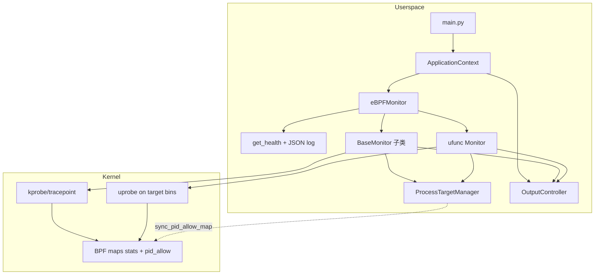
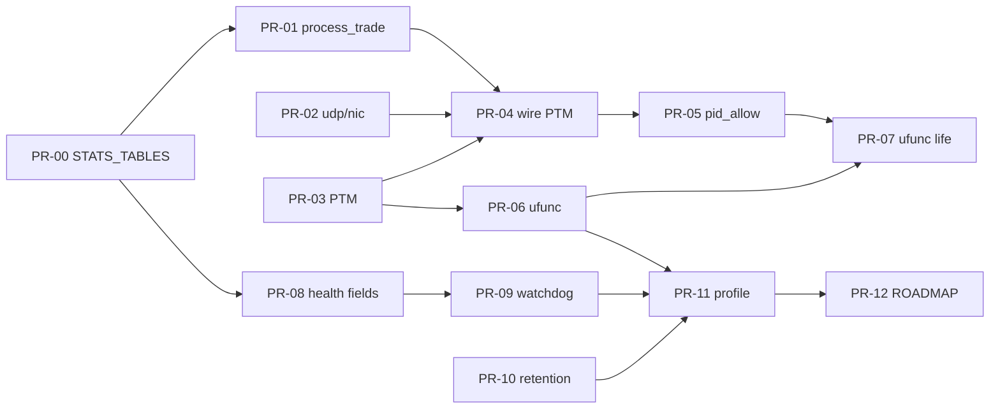

# 交易服务器长期稳定运行与多进程用户态函数采集设计文档

| 字段 | 值 |
|------|-----|
| **文档标题** | 交易服务器 eBPF 监控：长期稳定运行 + 按名称多进程目标 + 用户态函数调用采集 |
| **作者** | eBPF 项目设计（AI 起草 + 评审修订） |
| **日期** | 2026-08-06 |
| **修订** | 2026-08-06 r4（用户锁定 Q4/Q9；批准自 PR-00 起按序实现） |
| **状态** | Accepted |
| **关联仓库** | `/home/neo/ebpf` |
| **硬约束来源** | `docs/adr/0001-documentation-strategy-and-core-constraints.md`、`docs/ROADMAP.md` |

**阶段编号唯一真相**（全文一致，与 PR Plan 对齐）：

| Phase | 名称 | 主要 PR |
|-------|------|---------|
| **0** | 数据通路修复 | PR-00（多表基元）、PR-01、PR-02 |
| **1** | ProcessTargetManager | PR-03、PR-04 |
| **2** | BPF `pid_allow` | PR-05 |
| **3** | `ufunc` | PR-06、PR-07 |
| **4** | 运行时稳定性 | PR-08 剩余健康字段、PR-09、PR-10 |
| **5** | 文档 / analyzer | PR-11、PR-12、PR-13 |

---

## 1. Overview

本项目是基于 **eBPF + BCC** 的 Linux 监控系统，面向交易环境（ZMB/ZME 中间件、低延时网卡 SWIFT-2200N、UDP、SHM 等），当前已有 12 个监控器、守护进程模式、CSV/Console 输出，以及声明式 `PROMETHEUS_CONFIG` 提取辅助（**无**内置 HTTP exporter，见 §9）。用户目标是：在运行交易系统的服务器上**长期稳定运行**，依赖 eBPF 持续采集性能数据，并支持对**指定名称的多个进程**采集其内部函数调用与系统级信息。

与目标对照后，核心缺口有三：（1）`kfunc` 仅做**内核 kprobe**，无用户态 uprobe；（2）进程名过滤分散且部分配置项声明后未生效；（3）守护进程与多监控器运行时缺少健康度、隔离重启、map 压力、磁盘保留，难以作为生产常驻进程。

本设计在**不迁移 CO-RE/libbpf**、不改项目身份的前提下，给出可分阶段、可验收、可按 PR 落地的实现路径：统一 `ProcessTargetManager`、新增 `ufunc`、增强 `eBPFMonitor`/输出层稳定性，并修复已发现的数据通路与死配置缺陷。

---

## 2. Background & Motivation

### 2.1 当前架构（代码事实）

```
main.py
  └─ ApplicationContext (DI)
       ├─ ConfigManager / LogManager / OutputController / DaemonManager
       ├─ CapabilityChecker / MonitorRegistry / MonitorFactory
       └─ eBPFMonitor
            └─ BaseMonitor 子类 × N（@register_monitor 注册）
                 ├─ load_ebpf_program() → BPF(text=..., cflags=...)
                 ├─ run() → 线程 _monitor_loop
                 │    ├─ STATISTICAL: interval 后 _collect_and_output (map pop)
                 │    └─ EVENT: _poll_events (perf_buffer，目前主要 exec)
                 └─ output_controller.handle_data → CSV / Console
                      （PROMETHEUS_CONFIG 仅提取辅助；src/ 下无 HTTP exporter）
```

| 组件 | 路径 | 职责 |
|------|------|------|
| 入口 | `main.py` | CLI、`-m` 选择、daemon、主循环 |
| 控制器 | `src/ebpf_monitor.py` | 创建/加载/启停监控器，`MonitorStatus` |
| 基类 | `src/monitors/base.py` | 加载、双模式、pop、声明式 CSV/CONSOLE/PROMETHEUS |
| 注册 | `src/utils/decorators.py` + `monitor_registry.py` | `@register_monitor` 自动发现 |
| 工厂 | `src/utils/monitor_factory.py` | 构造 `MonitorContext` + 实例 |
| 配置 | `config/monitor_config.yaml` + `CONFIG_SCHEMA` | 每监控器 enabled/interval/过滤 |
| 守护 | `src/utils/daemon_manager.py` | 双 fork、PID 文件、SIGTERM **整进程** stop |
| eBPF C | `src/ebpf/*.c` | BCC 编译时加载，map 名约定 `{type}_stats` |

**监控器清单（12 个，已核实）**

| 名称 | 模式 | 过滤能力 | 备注 |
|------|------|----------|------|
| exec | EVENT | 无进程名过滤 | kprobe execve 多符号回退 |
| open | STAT | min_count / show_errors | 系统级 |
| bio | STAT | min_latency_us | 系统级 |
| syscall | STAT | categories / errors | 系统级 |
| **kfunc** | STAT | patterns / probe_limit | **仅内核 kprobe**，`/proc/kallsyms` |
| interrupt | STAT | — | 系统级 |
| page_fault | STAT | — | 系统级 |
| context_switch | STAT | min_switches | 系统级 |
| udp | STAT | 配置含 target_ports/processes | **二者在 should_collect 均未生效** |
| shm | STAT | target_shmids/processes | 用户态过滤生效 |
| process_trade | STAT | zmb/zme；monitor_syscalls/ipc | **map 名不一致**；`monitor_ipc` **未门控** |
| nic | STAT | interfaces/processes 配置 | **target_processes / target_interfaces 均未过滤**；默认 enabled:false |

### 2.2 痛点与已验证缺陷

#### A. 用户态函数调用 — 完全缺失

- `src/monitors/kfunc.py` + `src/ebpf/kfunc.c`：kprobe only。
- 仓库内 **零** `attach_uprobe` / `attach_uretprobe` 用法。

#### B. 按名称多进程目标 — 碎片化且有 bug

1. shm/process_trade 在 `should_collect` 过滤；**udp/nic 的 `target_processes` 未生效**。  
2. **同级死配置**：udp `target_ports`、nic `target_interfaces` 仅 schema/赋值，无过滤逻辑；process_trade `monitor_ipc` 配置不控制收集。  
3. 无共享 PTM；`comm` 仅 16 字节。  
4. 内核侧几乎无过滤；process_trade 对**全系统** `raw_syscalls` enter/exit 记账。

#### C. process_trade 数据通路缺陷（高严重度）

- Python：`stats_name = "process_trade_stats"`（`base.py:167`）。  
- C：`trade_syscall_stats`、`trade_ipc_stats`（`process_trade.c:78-80`）。  
- IPC key 为 `ipc_type`，value 仅 `{count, total_ns}`，与现有 CSV（`syscall_category`、`error_count`、min/max）**形状不一致**。  
- **结果**：主表 get 失败/空；IPC 从未 pop。

#### D. 长期生产稳定 — 能力不足

| 能力 | 现状 | 缺口 |
|------|------|------|
| 守护进程 | 双 fork + PID + SIGTERM 全量 stop | 无 per-monitor 重启、无 watchdog |
| 监控器故障 | 线程内 catch 异常后 continue | 无线程死亡探测；无 collect 失败阈值重启；无计数 |
| map 压力 | max_entries=10240，lookup 失败静默 | 无 drop 计数 |
| 输出背压 | `deque(maxlen=...)` 静默丢弃 | 无 drop 指标 |
| CSV 磁盘 | 无轮转/保留 | 长期运行可填盘 |
| Prometheus | 文档称端口 9200 | **`src/` 下无 prometheus_writer / HTTP server**；仅有 `PROMETHEUS_CONFIG` 提取 helper |
| 默认负载 | 多数 `enabled: true` | 交易机全开过重 |
| 测试 | base/registry/data_utils/nic | 无 PTM/稳定性/ufunc；MockBPF 无 uprobe |
| 分析 | analyzer 缺 udp/process_trade | 与文档一致 |

### 2.3 动机总结

交易服务器要求**低开销、可过滤、可常驻**。须在现有 `BaseMonitor`/DI 上扩展，先修数据通路，再统一进程目标、内核白名单、ufunc、稳定性。

---

## 3. Goals & Non-Goals

### 3.1 Goals（可验收）

1. **生产常驻（分里程碑）**  
   - 单监控器故障不拖垮进程；`restart_monitor` **始终经 Factory 新建实例**。  
   - 自健康：`get_health()` + 限速 JSON 日志（**Phase 4 不实现 Prometheus exporter**）。  
   - CSV 保留策略可配置。  
   - 提供 `trading_server` profile；**不**擅自改主 yaml 里重监控器默认 enabled。

2. **统一多进程按名目标**  
   - `ProcessTargetManager`；udp/shm/nic/process_trade/ufunc 接入。  
   - Phase 2：BPF `pid_allow`（写新后删旧，禁止先 clear）。

3. **用户态函数 `ufunc`**  
   - BCC uprobe/uretprobe，统计模式；默认 `enabled: false`；不改 `kfunc`。

4. **修复已知数据通路与死配置**  
   - process_trade map + 显式 IPC/syscall 行模型；`monitor_syscalls`/`monitor_ipc` 门控。  
   - udp/nic `target_processes`；并处理 `target_ports` / `target_interfaces`（实现或标 unsupported）。

### 3.2 Non-Goals

| 不做 | 原因 |
|------|------|
| CO-RE / libbpf 迁移 | ADR 0001 |
| 通用全栈 APM | 项目身份 |
| Phase 4 内新建 Prometheus HTTP exporter | 工作量独立；见 D16 |
| ufunc 首期 USDT / stack / EVENT 模式 | 防 scope creep |
| 强制删除 Python 2 兼容层 | 非本阶段 |
| 自动逆向 strip 二进制 | 需用户符号/偏移 |
| 改主 yaml 把 syscall/kfunc/open/bio 默认改 false | 仅 trading profile |
| 改变 `kfunc` 为 uprobe | 用 `ufunc` |
| 复用已 `cleanup` 的 monitor 实例做 restart | `_cleaned_up` 永久 |

---

## 4. Proposed Design

### 4.1 目标架构



### 4.2 ProcessTargetManager

**新文件**：`src/utils/process_target_manager.py`

**职责**：

1. 输入：进程名列表（`target_processes` 或 `zmb_processes`+`zme_processes` 合并）。  
2. 解析：默认读 `/proc/[pid]/comm`；`match_mode=cmdline_basename` 时用 cmdline 首段 basename。  
3. 输出：PID（tgid）集合、`should_include_comm`、`should_include_pid`、`sync_pid_allow_map`。  
4. 刷新：默认 5s。  
5. **comm**：配置名截断到 15 字符匹配内核 comm。

```python
class ProcessTargetManager(object):
    def __init__(self, process_names, logger, match_mode="comm", refresh_interval_s=5.0):
        ...

    def refresh(self):
        """扫描 /proc，更新 self._pids 与 self._comms_truncated"""

    def get_pids(self):
        # type: () -> List[int]
        ...

    def should_include_comm(self, comm):
        # type: (Any) -> bool
        """空目标列表 → True（全部允许）"""

    def should_include_pid(self, pid):
        # type: (int) -> bool
        ...

    def sync_pid_allow_map(self, bpf, map_name="pid_allow"):
        # type: (...) -> None
        """
        必需算法（禁止 clear 全表后再写）：
        1. new_set = 当前目标 PID 集合（targets 非空且已启用 ENABLE_PID_FILTER 时）
        2. 对每个 pid in new_set: map[pid] = 1（update/insert）
        3. 枚举 map 现有 keys；对 key not in new_set: delete(key)
        4. 禁止步骤：先 items.clear() / 先删全部再写
        目标为空时：调用方不得启用内核过滤（get_extra_cflags 不返回 -DENABLE_PID_FILTER=1）
        """
```

**验收（单测）**：mock map 记录操作序；`sync` 后不得出现「先空表再写入」；在 refresh 过程中允许瞬时「超集」（旧+新 PID），禁止「空集」。

**接入**：udp/shm/nic/process_trade 用户态；ufunc 驱动 pid_allow。优先监控器内懒创建 PTM。

#### 4.2.1 每监控器 cflags 集成路径（Phase 2 锁定，禁止发明其它入口）

**代码事实**：`MonitorFactory` 把 **同一份** `capability_checker.get_compile_flags()` 写入每个 `MonitorContext.compile_flags`；`BaseMonitor.load_ebpf_program` 直接使用 `self.compile_flags`。今日 **无** 每监控器附加 flags API。

**锁定方案（D23）——`get_extra_cflags()`，不改 Factory 签名、不改共享 list 原地 append**：

```python
# src/monitors/base.py  — PR-05 必改文件之一
def get_extra_cflags(self):
    # type: () -> List[str]
    """子类可覆盖；默认空。不得修改 self.compile_flags 本身。"""
    return []

def load_ebpf_program(self):
    ...
    cflags = list(self.compile_flags or []) + list(self.get_extra_cflags() or [])
    self.bpf = BPF(text=self.get_ebpf_code(), cflags=cflags)
    ...
```

```python
# src/monitors/udp.py / process_trade.py（及后续 ufunc 若需）
def _pid_filter_targets_nonempty(self):
    # udp: bool(self.target_processes)
    # process_trade: bool(self.zmb_processes or self.zme_processes)
    ...

def get_extra_cflags(self):
    if self._pid_filter_targets_nonempty():
        return ["-DENABLE_PID_FILTER=1"]
    return []
```

**C 侧模式（锁定）**：

```c
BPF_HASH(pid_allow, u32, u8, 1024);

static inline int allow_current(void) {
    u32 pid = bpf_get_current_pid_tgid() >> 32;
    u8 *p = pid_allow.lookup(&pid);
    if (!p)
        return 0;
    return 1;
}

// 在 probe 入口：
#ifdef ENABLE_PID_FILTER
    if (!allow_current())
        return 0;
#endif
```

**禁止**：

- 在共享 `compile_flags` list 上 `append`（会污染其它监控器）。  
- 未扩展 `get_extra_cflags` 却只在 yaml 注释里写 `-DENABLE_PID_FILTER`。  
- 本阶段改用「filter_enabled map」替代 cflags（若未来要做，须新 ADR/PR，不在 PR-05 发明）。

**空目标语义**：`[]` → `get_extra_cflags()` 返回 `[]` → 不定义宏 → 全量记账；非空 → `-DENABLE_PID_FILTER=1` + 用户态 `sync_pid_allow_map`。

**Merge gate（PR-05）**：mock `BPF` 构造参数，`targets` 非空时 `cflags` 含 `-DENABLE_PID_FILTER=1`；空 targets 时 **不含** 该宏。

### 4.3 用户态函数监控器 `ufunc`（新建）

**ADR 0001 解释（锁定）**：约束是 **BCC-only、禁止 CO-RE/libbpf**，以及优先 kprobe/tracepoint 务实路线。BCC 的 `attach_uprobe` / `attach_uretprobe` **允许**，作为 BCC 原生 attach 类型；**禁止** 为此引入 libbpf。本解释记入 ADR 0002（PR-13）。

| 文件 | 作用 |
|------|------|
| `src/ebpf/ufunc.c` | `ufunc_stats` + 探针占位 |
| `src/monitors/ufunc.py` | 符号、attach、CONFIG_SCHEMA |
| `tests/conftest.py` | **扩展 MockBPF：`attach_uprobe` / `attach_uretprobe`** |
| `tests/unit/test_ufunc_monitor.py` | 单测 |
| `config/monitor_config.yaml` | `ufunc:`，**enabled: false** |

#### 4.3.1 配置

**符号/函数列表归属（D26 / Q4 已决）**：运维或有源码的开发人员从**本方可访问的构建产物**生成 `targets`（函数名列表）；监控框架**只消费配置**，不逆向、不臆造交易函数名。用户有源码但**不向实现者分享源码**——实现与示例仅用占位名。

运行时服务器上需要：带符号的未 strip 二进制，或可解析的符号信息（调试符号构建 / 等价 symbols 文件，具体由运维在部署机准备）。AI/实现者 **禁止** 编造真实交易函数名。

```yaml
monitors:
  ufunc:
    enabled: false
    interval: 2
    target_processes: ["trade_app"]   # 与 /proc/pid/comm 一致的占位
    targets:
      # 路径与符号名均由有源码/构建权限的运维填写；下列为占位示例
      - binary: "/path/to/trade_app"
        symbols:
          - name: "handle_order"
            retprobe: false
          - name: "match"
            retprobe: true
    probe_limit: 32
    resolve_from_pid: true   # binary 省略时从 /proc/pid/exe
```

#### 4.3.2 符号与 attach

1. 优先显式 `binary` 绝对路径 + **用户配置的** symbol name（D26）。  
2. **默认 attach 策略**（D7）：`pid=-1` 全局 uprobe + `pid_allow`。  
3. **回退序**（见 §7.6）：若全局 attach 失败 → per-pid attach → 用户态-only 过滤并 ERROR 日志。  
4. 单符号失败：warning 跳过；**0 个成功 → load 失败**，不影响其他监控器。  
5. **load 时无目标进程**：  
   - 若配置了显式 `binary` 且文件存在：仍可 attach（pid=-1），pid_allow 可为空集但 **targets 非空时** 需在 refresh 写入 PID；在 PID 出现前统计为 0（合法）。  
   - 若仅 `resolve_from_pid` 且当前 0 PID：**软失败**——`load_ebpf_program` 返回 True 但 `attached_count=0`，进入 **retry 状态**：每个 refresh 周期重试 resolve+attach，直到成功或用户停用；`get_health` 报告 `waiting_for_process=true`。  
   - **不**因短暂无进程而拖垮 eBPFMonitor。
#### 4.3.3 数据模型与 retprobe

```c
struct ufunc_stats_key_t {
    char comm[TASK_COMM_LEN];
    u32 func_id;
    u32 tgid;   /* D14：始终含 tgid */
};
struct ufunc_stats_value_t {
    u64 count;
    u64 total_ns;  /* retprobe 成功配对时累加；否则 0 */
    u64 max_ns;
};
BPF_HASH(ufunc_stats, struct ufunc_stats_key_t, struct ufunc_stats_value_t, 10240);

/* entry 配对 key：禁止对完整 pid_tgid 再 <<32（会丢掉 tgid 半部并碰撞）
 * bpf_get_current_pid_tgid() 已是 u64: (tgid << 32) | pid
 */
struct ufunc_entry_key_t {
    u64 pid_tgid;   /* 原样存放 bpf_get_current_pid_tgid() */
    u32 func_id;
    u32 _pad;       /* 显式填充；构造时 __builtin_memset 整键为 0 */
};
BPF_HASH(ufunc_entry, struct ufunc_entry_key_t, u64, 10240);  /* value = start_ts_ns */
```

**entry 键构造（C 侧锁定伪代码）**：

```c
struct ufunc_entry_key_t ek = {};
__builtin_memset(&ek, 0, sizeof(ek));
ek.pid_tgid = bpf_get_current_pid_tgid();  /* 不得再移位 */
ek.func_id = func_id;
/* uprobe: ufunc_entry.update(&ek, &ts); 并 update 统计 count */
/* uretprobe: lookup ek → latency；delete；更新 total_ns/max_ns */
```

**禁止的错误打包（实现者不得使用）**：

- `key = pid_tgid << 32 | func_id`（移出 tgid，多线程/多 func 错配）  
- `key = (pid_tgid & 0xffffffff) << 32 | func_id`（仅保留 pid，仍丢 tgid 语义且与 func 混用不当）  
- 单 `u64` 塞两个 id 且 `probe_limit>1` 无文档证明不碰撞的方案  

**retprobe 语义（best-effort，锁定）**：

- entry 在 uprobe：写 `ufunc_entry[ek]=ts`，并在 **entry 路径** 对 `ufunc_stats` 做 `count++`。  
- uretprobe：用同一 `ek` lookup；命中则算 `now-ts`，更新 `total_ns`/`max_ns`，`delete` entry。  
- **嵌套/递归同符号**：同一 `(pid_tgid, func_id)` 单 slot 覆盖 → latency **不可靠**（已知限制）；count 仍以 entry 为准。  
- 若 ret 找不到 entry → **只保留 count，不改 total_ns/max_ns**。  
- entry map 满：count 仍尽量更新；latency 丢弃。  
- `retprobe: false`：不 attach uretprobe，不写 `ufunc_entry`。  

**单测/mock 期望（PR-06）**：生成的 C 文本或 helper 断言 entry key 为 **struct 双字段**（`pid_tgid` + `func_id`），且源码中 **不出现** `pid_tgid << 32` 与 `func_id` 的或运算打包。

#### 4.3.4 生命周期

**进程退出/新起**：refresh 维护 pid_allow；pid=-1 模式无需 re-attach。  
**二进制热更新**：不自动 re-attach；运维调用 `restart_monitor("ufunc")`（§4.4.1 全新建实例）。

#### 4.3.5 能力检查与内核矩阵（Q9 已决）

- **多版本内核混部 / 矩阵未知**：不宣称「全局 3.10+ 均支持 uprobe」。项目其它监控器仍可标 3.10+；**ufunc 单独**以运行时能力为准。  
- `UfuncMonitor._validate_requirements` / load：检查 BCC 是否具备 `attach_uprobe`；binary 路径（若配置）是否存在。  
- **uprobe 不可用**：**软失败**——该监控器 load/attach 失败并记 `status.error`，**不**拖垮 `eBPFMonitor` 及其它监控器；`get_health` 可区分 `uprobe_unavailable`。  
- 真机 smoke / 版本矩阵：**留给部署方**在目标内核上验证；不设仓库内固定多版本 CI 矩阵为合并门禁。
#### 4.3.6 开销

默认关；`probe_limit`；仅 STATISTICAL；**禁止** USDT/stack/EVENT 在 ufunc PR 中引入。

### 4.4 长期稳定运行

#### 4.4.1 `restart_monitor` 生命周期（锁定：禁止复用实例）

`BaseMonitor.cleanup()` 设置 `_cleaned_up=True` 且 `bpf.cleanup()`，**不可**对同一实例再次 `load_ebpf_program`/`run`。

**强制规则**：`restart_monitor(name)` **永远** `MonitorFactory.create_monitor` 新建实例。

**伪代码（持 `state_lock` 全流程，禁止与 collect 并发 stop 时无锁）**：

```text
def restart_monitor(self, name, reason=""):
    with self.state_lock:
        if name not in self.monitors and name not in expected_enabled:
            return False
        old = self.monitors.get(name)
        # 1) 停线程
        if old is not None:
            try:
                if old.is_running():
                    old.stop()          # stop_event + join
            except Exception as e:
                log error
            try:
                self.output_controller.unregister_monitor(name)  # 关闭旧 CSV
            except Exception:
                pass
            try:
                old.cleanup()           # bpf.cleanup；实例作废
            except Exception:
                pass
            self.monitors.pop(name, None)
        # 2) 新建（永远 factory）
        cfg = getattr(self.monitors_config, name)
        new = self.context.get_monitor_factory().create_monitor(
            self.all_monitors[name], name, cfg)
        if not new.enabled:
            update status disabled; return False
        # 3) load + 注册输出 + run
        if not new.load_ebpf_program():
            status.error = "reload load failed"; return False
        self.output_controller.register_monitor(name, new)
        # 注意：CsvWriter.setup_file → 新时间戳 CSV 文件（与现网行为一致，文档写明「restart 轮转新文件」）
        if not new.run():
            status.error = "reload run failed"; return False
        self.monitors[name] = new
        status.loaded=True; status.running=True; status.error=None
        status.last_update=now; status.restart_count += 1
        log INFO "monitor_restart name=%s reason=%s" % (name, reason)
        return True
```

**并发**：`_collect_and_output` 与 restart 之间依赖 stop join；`state_lock` 保护 `self.monitors` 字典替换。  
**BCC 重编译成本**：每次 restart 重新 `BPF(text=...)` 编译；交易机上视为 **中高成本**（秒级可能）。Watchdog **必须**退避：默认 60s 窗口内同一 monitor 最多 3 次 restart；超限则 `degraded`，仅日志，不再自动 restart，直到人工或进程级重启。  
**不做**：进程级 `eBPFMonitor.cleanup()` 作为 restart 的一步（会清空全部 monitors）。

#### 4.4.2 Watchdog 触发条件（双条件，非仅 thread_alive）

配置：

```yaml
app:
  watchdog_enabled: true
  watchdog_interval: 10          # 秒
  watchdog_stale_intervals: 5    # last_success 超过 interval * N 视为 stale
  watchdog_error_delta: 50       # 一个 watchdog 周期内 collect_error_count 增量阈值
  watchdog_max_restarts_per_window: 3
  watchdog_restart_window_s: 60
```

**触发 restart 若任一成立**（且 monitor 应为 running）：

1. `running` 标志为真但 `not is_thread_alive()`；或  
2. `last_success_ts` 过旧：`now - last_success_ts > interval * watchdog_stale_intervals`（且至少完成过一次成功 collect 或已启动超过该阈值）；或  
3. 本窗口 `collect_error_count` 增量 ≥ `watchdog_error_delta`。

统计循环已 catch 异常 → 线程很少死；故 **2/3 必需**。  
`last_success_ts`：`_collect_and_output` 在 **成功完成 pop 循环**（含 0 行数据）后更新；`get_table` 失败则只加 `collect_error_count`。

#### 4.4.3 Map 压力

- Python：`get_table` 失败 → `map_lookup_fail_count += 1`。  
- C 侧 drop 计数：可选延后；最低用户态计数即可过 Phase 4。

#### 4.4.4 输出背压与 CSV 保留

- append 前若 `len(deque)==maxlen` → `output_drop_count[monitor]+=1` 再 append。  
- retention 配置同前；启动 + 每小时清理。  
- `ENOSPC`：记错误，不 `sys.exit`。

#### 4.4.5 默认配置与 trading profile

- 新增 `config/monitor_config.trading_server.yaml`（减负）。  
- **禁止** 在未单独产品决策时把主 `monitor_config.yaml` 里 syscall/kfunc/open/bio 默认改为 false（D11 + 护栏 18）。  

**D13 空 targets 强制路径（锁定，路径 A——无 environment 穿线）**：

| 机制 | 行为 |
|------|------|
| `monitor_config.trading_server.yaml` | **静态**写明非空 `zmb_processes` / `zme_processes` 示例列表（可占位真实 comm）；PR-11 验收：该文件中二者不得同时为 `[]` |
| 主 `monitor_config.yaml` | 允许空列表（开发语义=全进程）；USER_GUIDE **警告** 全机 raw_syscalls 风险 |
| `ProcessTradeMonitor.validate_config(config)` | **仅**见 monitor 字典：校验类型/required；若 `monitor_syscalls` 与 `monitor_ipc` 皆 false → `ValueError`；**不**读取 `app.environment`（今日 API 无此参数，禁止假装能读） |
| `app.environment: production` | **单独不会**自动拒绝空 zmb+zme；不在 PR-01 发明 context 穿线 |
| 可选（非必须） | 无 |

**禁止**：在 `validate_config` 内写 `os.environ` 或全局单例读 app 配置冒充 environment 校验。

#### 4.4.6 process_trade 修复 + **锁定 CSV 行模型**（Phase 0 / PR-01）

**C map 命名**：

| 原名 | 新名 |
|------|------|
| `trade_syscall_stats` | `process_trade_stats` |
| `trade_ipc_stats` | `process_trade_ipc_stats` |

**多表收集 + 门控（实例级 STATS_TABLES，锁定）**：

- 类上可保留文档性默认，但 **运行时以实例属性为准**（见 §4.5）。  
- `ProcessTradeMonitor._initialize` **必须**根据配置构建实例表：

```python
def _initialize(self, config):
    tables = []
    if self.monitor_syscalls:
        tables.append(("process_trade_stats", "syscall"))
    if self.monitor_ipc:
        tables.append(("process_trade_ipc_stats", "ipc"))
    if not tables:
        raise ValueError("process_trade: monitor_syscalls and monitor_ipc cannot both be false")
    self.STATS_TABLES = tables  # 实例属性，覆盖类属性
```

**统一输出行模型（锁定，禁止实现者另造 schema）**：

在 `_collect_and_output` 的 pop 之后、`handle_data` 之前调用 **`stat_data = self._normalize_stat_row(stat_data, record_type)`**（§4.5）。  
normalize **写平** 下列字段后，`CSV_COLUMNS` **只使用二元组** `("col", "key")`（或已存在于 data 的派生键），**不依赖** `("col", "key", fn)` 三元组——因当前 `BaseMonitor._extract_column_value` 仅当 `col_def[1]` 为 callable 时做转换，**三元组第三项 transform 实际不会执行**（代码事实，PR-00/PR-01 不得假装已修好 unless 单独修 extract）。

| 列名（CSV） | normalize 后 data 键 | 规则 |
|-------------|----------------------|------|
| `record_type` | `record_type` | 参数 `record_type`（`syscall`/`ipc`） |
| `comm` | `comm` | key.comm 解码后字符串 |
| `category` | `category` | syscall：`category_to_str(syscall_category)`；ipc：下表 |
| `count` | `count` | value.count |
| `error_count` | `error_count` | syscall：原值；**ipc：0** |
| `error_rate` | `error_rate` | `calc_error_rate(count, error_count)` 写入 float |
| `avg_latency_us` | `avg_latency_us` | `MonitorDataUtils.calc_avg_latency_us(total_ns, count)` |
| `min_latency_us` | `min_latency_us` | syscall：`calc_min_latency_us(min_ns)`；**ipc：0** |
| `max_latency_us` | `max_latency_us` | syscall：`calc_max_latency_us(max_ns)`；**ipc：0** |

**ipc_type → category 字符串（固定表）**：

| ipc_type | category |
|----------|----------|
| 1 | `IPC_PIPE` |
| 2 | `IPC_SHM` |
| 3 | `IPC_FUTEX` |
| 4 | `IPC_MSG` |
| 其他 | `IPC_UNKNOWN` |

**声明式 CSV（仅简单映射）**：

```python
CSV_COLUMNS = [
    ("record_type", "record_type"),
    ("comm", "comm"),
    ("category", "category"),
    ("count", "count"),
    ("error_count", "error_count"),
    ("error_rate", "error_rate"),
    ("avg_latency_us", "avg_latency_us"),
    ("min_latency_us", "min_latency_us"),
    ("max_latency_us", "max_latency_us"),
]
```

**收集门控**：由实例 `STATS_TABLES` 决定 pop 哪些表（false 的一侧不在列表中）。  
**should_collect**：进程名过滤（zmb+zme）；空列表=全部（开发默认）；生产减负靠 trading yaml 非空（D13 路径 A）。

**单测**：mock 两表；断言 IPC 行 `error_count==0`、`min/max latency 键==0`、`record_type=="ipc"`、category 映射；`monitor_ipc=false` 时实例 `STATS_TABLES` 仅含 syscall。

### 4.5 BaseMonitor 多表 API（PR-00，供 PR-01 使用）

```python
# 类属性默认；运行时可被实例属性覆盖
STATS_TABLES = None  # type: Optional[List[tuple]]

def _iter_stats_tables(self):
    # 锁定解析序（D24）：
    # 1) 若实例 __dict__ 中存在 STATS_TABLES 且不为 None → 用实例
    # 2) 否则若 type(self).STATS_TABLES 不为 None → 用类
    # 3) 否则 → [(self.stats_name, "default")]
    if "STATS_TABLES" in self.__dict__ and self.__dict__["STATS_TABLES"] is not None:
        tables = self.__dict__["STATS_TABLES"]
    elif type(self).STATS_TABLES is not None:
        tables = type(self).STATS_TABLES
    else:
        tables = [(self.stats_name, "default")]
    for item in tables:
        yield item  # (map_name, record_type)

def _normalize_stat_row(self, stat_data, record_type):
    # type: (Dict[str, Any], str) -> Dict[str, Any]
    """默认 no-op。子类可写平字段。record_type 来自 STATS_TABLES 第二元。"""
    return stat_data

def _collect_and_output(self):
    for map_name, record_type in self._iter_stats_tables():
        # get_table(map_name); pop keys;
        # if not should_collect: continue
        # stat_data = {timestamp, ...struct fields...}
        # stat_data = self._normalize_stat_row(stat_data, record_type)
        # output_controller.handle_data(...)
        ...
```

**PR-00 范围**：`_iter_stats_tables` + 多表 pop 循环 + 默认 `_normalize_stat_row` no-op；**不**强制修三元组 transform（可另开 PR；process_trade 用 normalize 规避）。  
**PR-01 范围**：实例 `STATS_TABLES` 构建 + `ProcessTradeMonitor._normalize_stat_row` + 简单 `CSV_COLUMNS` + map 改名。  
process_trade **不得**再维护永久独立 pop 循环。

### 4.6 与现有模式契合

- `@register_monitor` + `CONFIG_SCHEMA` + 声明式 CSV。  
- STATISTICAL 为主。  
- BCC `BPF(text=...)`；`MonitorFactory` 路径 `{type}.c`。

---

## 5. API / Interface Changes

### 5.1 配置

```yaml
app:
  environment: development   # 元数据/日志用；不单独触发 process_trade 空 targets 拒绝（D13 路径 A）
  watchdog_enabled: true
  watchdog_interval: 10
  watchdog_stale_intervals: 5
  watchdog_error_delta: 50
  watchdog_max_restarts_per_window: 3
  watchdog_restart_window_s: 60

output:
  csv_retention:
    enabled: true
    max_age_days: 7
    max_total_bytes_mb: 4096
    max_files_per_monitor: 64

monitors:
  ufunc:
    enabled: false
    interval: 2
    target_processes: []
    targets: []
    probe_limit: 32
    resolve_from_pid: true
```

### 5.2 代码符号

| 符号 | 变更 |
|------|------|
| `BaseMonitor.STATS_TABLES` | 类默认 + **可被实例覆盖**；`(map_name, record_type)` |
| `BaseMonitor._normalize_stat_row` | 默认 no-op；process_trade 写平字段 |
| `BaseMonitor.get_extra_cflags` | 默认 `[]`；targets 非空时 `["-DENABLE_PID_FILTER=1"]` |
| `BaseMonitor.load_ebpf_program` | `cflags = list(compile_flags)+list(get_extra_cflags())`（新 list） |
| `BaseMonitor.last_success_ts` / `collect_error_count` / `map_lookup_fail_count` | 新增 |
| `eBPFMonitor.restart_monitor` / `get_health` | 新增；restart **仅** factory 新建 |
| `ProcessTargetManager.sync_pid_allow_map` | 写新后删旧 |
| `struct ufunc_entry_key_t` | `{u64 pid_tgid; u32 func_id; u32 _pad}`；禁止 `pid_tgid<<32\|func_id` |
| `tests/conftest.MockBPF` | `attach_uprobe` / `attach_uretprobe`；可记录 ctor `cflags` |
### 5.3 CLI

不新增管理 CLI；靠 watchdog + 运维重启进程。

---

## 6. Data Model Changes

### 6.1 CSV：`ufunc`

`timestamp, comm, tgid, func_name, count, avg_latency_us, max_latency_us`  
（无 retprobe 或 pairing 失败：latency 为 0）

### 6.2 CSV：`process_trade`（锁定）

见 §4.4.6：新增 `record_type` 列；`category` 统一字符串列；IPC 缺省字段填 0。  
**破坏性**：旧 CSV 无 `record_type`；analyzer 宽松读。USER_GUIDE 注明 Phase 0 修复前 CSV 可能为空（map 名 bug）。

### 6.3 迁移

无 DB；map 重命名无持久状态。

---

## 7. Alternatives Considered

### 7.1 扩展 `kfunc` 同时 kprobe+uprobe

破坏语义 → **拒绝**；新建 `ufunc`。

### 7.2 每监控器独立 OS 进程

过重 → **拒绝**；进程内 restart。

### 7.3 libbpf/CO-RE

违反 ADR → **拒绝**。

### 7.4 仅用户态过滤

Phase 1 先做；Phase 2 加 pid_allow。

### 7.5 事件模式 ufunc

高频不安全 → **拒绝** 首期。

### 7.6 uprobe attach 策略对比（实现回退序）

| 策略 | 优点 | 缺点 | 地位 |
|------|------|------|------|
| A. `pid=-1` + `pid_allow` | 动态 PID 无需 re-attach；attach 次数少 | 全局符号命中面大；依赖 pid_allow 正确 | **默认（D7）** |
| B. per-pid `attach_uprobe(pid=...)` | 隔离好 | 进程抖动需 detach/attach；多实例成本高 | **回退 1**（A 失败时） |
| C. 全局 uprobe + 仅用户态 comm 过滤 | 实现简单 | 内核仍执行探针体；开销大 | **回退 2**（仅统计仍要数据时）；须 ERROR 日志 |
| D. 无 uprobe、采样 /proc | 无探针 | 无函数级 | **不做** |

多版本同名二进制：配置 **显式 absolute binary path**；不同 path 多条 `targets[]`。

---

## 8. Security & Privacy

| 风险 | 严重度 | 缓解 |
|------|--------|------|
| root/CAP_BPF | 高 | capability_checker |
| 错误 binary uprobe | 中 | 绝对路径 + isfile |
| 配置注入 | 低 | 不 shell 拼接 |
| probe 拖垮交易 | **高** | 默认关、probe_limit、trading profile |
| pid_allow 空窗全丢 | **高** | **禁止 clear-first**；写新后删旧（§4.2） |
| 全局 uprobe 在共享主机 | 高 | D15：默认 A 但仅 trading 专用机；文档警告共享机用 B |
| process_trade 空 targets 全机 syscall | **高** | trading yaml 静态非空（D13 路径 A）+ USER_GUIDE；Phase 2 pid_allow |

---

## 9. Observability

### 9.1 日志

- rate-limit：map/attach 失败 60s 一条 summary。  
- restart：`monitor_restart name= reason=`。  
- Phase 0 运维注记：修复前 process_trade CSV 可能因 map 名长期为空。

### 9.2 自健康（Phase 4 最低交付，锁定）

**代码事实**：`src/utils/` **不存在** Prometheus HTTP exporter / `prometheus_writer`；文档/ROADMAP 中的 9200 端口 **当前未实现**。

**Phase 4 必做**：

1. `eBPFMonitor.get_health()` → dict：每监控器 `loaded/running/thread_alive/last_success_ts/collect_error_count/map_lookup_fail_count/restart_count/error`。  
2. 每 60s 限速 `logger.info` 一行 JSON（或 structured key=value）。  

**明确延期**：Prometheus gauge / alert_rules PromQL **直到** 独立 PR 实现 exporter 后再做（不在 Phase 4 验收内）。alert_rules 扩展标为「exporter exporter」。

### 9.3 告警

Phase 4：依赖日志/健康 JSON 的人工或外部 log 检查。  
不写无法 scrape 的 PromQL 伪需求。

---

## 10. Rollout Plan

与 §11、PR Plan **同一编号**：

| 阶段 | 内容 | 回滚 | 主要 PR |
|------|------|------|---------|
| Phase 0 | process_trade map/IPC 行模型；udp/nic 过滤与死配置 | revert | PR-00, PR-01, PR-02 |
| Phase 1 | PTM + 接入 | 行为兼容 | PR-03, PR-04 |
| Phase 2 | pid_allow + get_extra_cflags（写新删旧） | 空 targets 即无宏 | PR-05 |
| Phase 3 | ufunc（默认 false） | 不启用 | PR-06, PR-07 |
| Phase 4 | watchdog 双条件+退避、CSV retention、get_health | watchdog_enabled:false | PR-08 余下, PR-09, PR-10 |
| Phase 5 | ROADMAP/USER_GUIDE/analyzer/ADR | 文档-only | PR-11, PR-12, PR-13 |

**实现启动（用户已批准）**：按 PR Plan **自 PR-00 起顺序实施**，不跳过依赖、不并行发明范围。

**验收环境**：开发机 → 交易备机 → 生产旁路。
---

## 11. Phased Implementation（严格顺序）

每阶段验收分 **Merge gate（pytest）** 与 **Manual smoke（人工，非合并阻塞）**。

### Phase 0 — 数据通路修复与死配置

**目标**：修正 process_trade 与 udp/nic 配置空转。

**范围**：

- PR-00：`base.py` `STATS_TABLES` + 多表 pop + 单测  
- PR-01：process_trade C/Python 行模型 + `monitor_ipc`/`monitor_syscalls` 门控  
- PR-02：udp/nic `target_processes`；`target_ports` / `target_interfaces` 实现或明确 unsupported  

**PR-02 对 target_ports / target_interfaces 的锁定选择**：

- **udp `target_ports`**：C 侧当前 **不** 把 port 放入 stats key（仅 comm+direction）。Phase 0 **不** 改 C 布局。  
  - **行为**：配置非空时，在 USER_GUIDE/ROADMAP 标为 **`unsupported until map key includes port`**；`validate_config` 若 `target_ports` 非空则 **WARNING**（不 fail），`should_collect` 忽略 port。  
  - **禁止** 文档继续宣称「已支持端口过滤」直至后续专用 PR 改 `udp.c` key。  
- **nic `target_interfaces`**：C 侧无 interface 字段在 stats key 中可用时同样 **WARNING + unsupported**；若后续 nic 有 ifindex 再实现。Phase 0 只修 `target_processes`。

**范围外**：ufunc、watchdog、PTM、pid_allow。

**依赖**：无（PR-00 先于 PR-01）。

**Merge gate**：

1. `pytest tests/unit/test_base_monitor.py`：多表 pop；`_normalize_stat_row` 默认 no-op；实例 `STATS_TABLES` 优先于类。  
2. `pytest tests/unit/test_process_trade_monitor.py`：两表 mock、IPC 零填充、`record_type`、`_normalize_stat_row` 写平字段、`monitor_ipc=false` 时仅 syscall 表。  
3. udp/nic：`target_processes` 空/非空行为单测。  

**Manual smoke**：`sudo python main.py -m process_trade` 配置真实 comm 时 CSV 非空。

**风险**：map 重命名（无持久）。process_trade 在 Phase 2 前仍为全机 raw_syscalls 开销。

**运维注记（USER_GUIDE 一句）**：pre-fix 版本 process_trade CSV 可能因 map 名 mismatch 为空。

---

### Phase 1 — ProcessTargetManager

**目标**：共享进程目标与 comm 语义。

**范围**：`process_target_manager.py`；接入 udp/shm/nic/process_trade；USER_GUIDE comm 限制。

**范围外**：pid_allow、uprobe。

**依赖**：Phase 0。

**Merge gate**：PTM 单测（截断、空=全部）；四监控器接入测试。  
**Manual smoke**：可选。

---

### Phase 2 — BPF pid_allow + get_extra_cflags

**目标**：udp + process_trade 内核跳过非目标；cflags 按监控器正确注入。

**范围**：`base.py`（`get_extra_cflags` + load 拼接）、`.c`（`#ifdef ENABLE_PID_FILTER` + `pid_allow`）、udp/process_trade `.py`（override + sync）；**resync 写新删旧** 单测。

**依赖**：Phase 1。

**Merge gate**：

1. `sync_pid_allow_map` 操作序单测（无 clear-first）。  
2. mock `BPF(..., cflags=...)`：targets 非空 → cflags 含 `-DENABLE_PID_FILTER=1`；空 → 不含。  
3. 共享 `compile_flags` list 在 load 前后 identity/内容不被原地修改（单测）。  

**Manual smoke**（非 CI）：targets 非空时非目标进程不增长对应 map 键。

**风险**：空表全丢 — 空目标不定义宏 + 禁止 clear-first。

---

### Phase 3 — ufunc

**目标**：指定二进制用户态符号统计。

**范围**：ufunc.c/py、conftest MockBPF uprobe、yaml 默认 false、文档。

**范围外**：USDT、stack、EVENT、CO-RE。

**依赖**：Phase 1；pid_allow 强烈建议（PR-07 依赖 PR-05）。

**Merge gate**：注册名；探针生成；probe_limit；MockBPF attach_uprobe；0 探针 load 失败；**源码/生成 C 含 `struct ufunc_entry_key_t` 且无 `pid_tgid << 32` 与 func_id 或打包**。  
**Manual smoke**：真机 bash/测试 so，`count>=1`。

**load 无进程**：见 §4.3.2 软失败+retry。
---

### Phase 4 — 运行时稳定性

**目标**：长期跑、可恢复、磁盘可控。

**范围**：restart（factory-only）、watchdog 双条件+退避、CSV retention、drop 计数、get_health JSON log、trading profile。

**范围外**：Prometheus exporter、多 OS 进程、二进制热切换自动 re-attach。

**依赖**：Phase 0；PR-00 已含多表。可与 Phase 3 部分并行。

**Merge gate**：

1. 假死线程 → restart 调用 factory（mock）。  
2. 连续 1000 次 collect 异常 mock → 进程不 exit；error_count 增加。  
3. stale last_success → 触发 restart（mock 时间）。  
4. 60s 窗口第 4 次 restart 被抑制。  
5. retention 在 tempdir 删超龄文件。  
6. ENOSPC mock 不崩溃。  

**Manual smoke**：文档 runbook；非必须多小时 soak 进 CI。  
**Soak 说明（文档）**：备机建议 ≥2h 观察 RSS；process_trade 在 Phase 2 前勿全机开启。

---

### Phase 5 — 文档与 analyzer

**目标**：ROADMAP/ARCHITECTURE/USER_GUIDE 事实同步；analyzer 支持 udp/process_trade/ufunc 基础读取。

**Merge gate**：analyzer 对未知 type 不再误报（单元或 CLI dry 测）。  
**Manual**：文档审阅。

---

## 12. Key Decisions

| # | 决策 | 理由 |
|---|------|------|
| D1 | 不迁移 CO-RE/libbpf | ADR 0001 |
| D2 | 新建 `ufunc`，不改 `kfunc` | 失败域分离 |
| D3 | 统计聚合为主 | 交易机高频 |
| D4 | 共享 ProcessTargetManager | 去重与修死配置 |
| D5 | 空 target = 全部；非空 = 白名单 | 与 shm 一致 |
| D6 | 默认 match `comm`，15 字符截断 | 内核限制 |
| D7 | uprobe 默认 pid=-1 + pid_allow；回退 per-pid | 动态进程集 |
| D8 | 进程内 watchdog；restart **始终 factory 新建** | `_cleaned_up` 不可复用 |
| D9 | CSV retention 必做 | 磁盘 |
| D10 | Phase 0 先修 process_trade | 数据名存实亡 |
| D11 | 减负仅 trading profile；不擅自改主 yaml 重监控默认 | 防静默行为变化 |
| D12 | 策略变更更新 ROADMAP/ADR | 卫生规则 |
| **D13** | **process_trade 保留 zmb/zme 键；空 targets 强制仅靠 trading_server.yaml 静态非空 + USER_GUIDE 警告；`validate_config` 不读 `app.environment`** | API 无 environment 穿线；避免假校验 |
| **D14** | **ufunc stats key 含 tgid；match 默认 comm** | 多实例可分 |
| **D15** | **全局 uprobe 允许但仅专用交易机推荐；共享机评估 per-pid** | 安全/noisy neighbor |
| **D16** | **Phase 4 自健康 = get_health + JSON 日志；Prometheus exporter 独立延期** | 代码无 exporter 属实 |
| **D17** | **process_trade CSV：normalize 写平 + 仅二元组 CSV_COLUMNS；IPC 填 0 + 固定枚举** | 绕过坏掉的三元组 transform |
| **D18** | **pid_allow resync：写新后删旧，禁止 clear-first** | 避免统计空洞 |
| **D19** | **PR-00 STATS_TABLES 先于 PR-01**；process_trade 不双轨 pop | 防重写两次 |
| **D20** | **ADR：BCC-only；uprobe 作为 BCC attach 允许** | 消解 ADR 字面误解 |
| **D21** | **Watchdog：dead thread 或 stale success 或 error delta；带重启退避** | 线程很少死 |
| **D22** | **udp target_ports / nic target_interfaces：Phase 0 标 unsupported+WARNING** | C key 无字段 |
| **D23** | **每监控器 cflags：`get_extra_cflags()` + load 时拼接新 list；禁止改共享 compile_flags** | 对接 MonitorFactory 现状 |
| **D24** | **`_iter_stats_tables`：实例 `__dict__` → 类属性 → 默认单表；门控在 `_initialize` 建实例表** | monitor_* 为实例配置 |
| **D25** | **ufunc_entry key = `struct {u64 pid_tgid; u32 func_id; u32 _pad}`，原样存 pid_tgid** | 禁止 `<<32` 错配 |
| **D26** | **ufunc 符号/函数名与 binary 路径由运维（有源码或构建权限方）提供；框架只接受配置；示例仅用占位名** | 用户有源码但不外泄；禁止实现者臆造交易函数 |
| **D27** | **ufunc 不宣称全局 3.10 uprobe；load 时能力检查，不可用则该监控器软失败** | 内核矩阵混杂/未知（Q9） |

---

## 13. AI Implementation Guardrails

1. **禁止** libbpf、CO-RE、cilium、bpftrace 作主路径。  
2. **禁止** 未更新 ROADMAP/ADR 合并新监控器类型。  
3. **禁止** 改 `kfunc` 为 uprobe。  
4. **必须** 新监控器：`.c` + `.py` + register + SCHEMA + unit test + yaml。  
5. **必须** map 名 = `{type}_stats`（IPC 附属 map 用 `{type}_ipc_stats`）。  
6. **必须** 继承 BaseMonitor；多表只用 `STATS_TABLES`。  
7. **必须** 新重能力默认 `enabled: false`。  
8. **禁止** 愿景文档句。  
9. **禁止** 弱化 probe_limit 仅为过测。  
10. **单 PR 单主题**；按 PR Plan。  
11. **测试**：pytest + mock bcc；真机 smoke 不替代单测。  
12. 配置键英文；日志可中文。  
13. **不要** 删 `py2_compat.py` 除非独立 PR。  
14. `should_collect`：空列表不过滤。  
15. 不 shell 拼接配置；binary 校验存在。  
16. **ufunc PR 禁止** 增加 USDT、stack walk、EVENT/perf_buffer 模式。  
17. **任何新 attach API 必须扩展** `tests/conftest.py` MockBPF。  
18. **禁止** 在主 `monitor_config.yaml` 将 syscall/kfunc/open/bio 默认改为 false，除非独立产品决策 PR；减负只加 trading profile。  
19. **禁止** `restart_monitor` 复用已 cleanup 实例。  
20. **禁止** `sync_pid_allow_map` clear-first。  
21. **禁止** 改 process_trade CSV 列集合偏离 §4.4.6。  
22. **禁止** 宣称 target_ports/interfaces 已支持直至 C key 具备字段。  
23. **禁止** `ufunc_entry` 使用 `pid_tgid << 32 | func_id`（或任何移出 tgid 半部的打包）。  
24. **禁止** 在共享 `compile_flags` 上原地 append；必须用 `get_extra_cflags()`。  
25. **禁止** 在 `validate_config(monitor_dict)` 内假装能读 `app.environment` 做空 targets 拒绝。  
26. process_trade 派生列必须在 `_normalize_stat_row` 写平；**禁止**依赖未修复的 CSV 三元组 transform。  
27. **禁止** 臆造交易业务函数名或真实 binary 路径；配置示例仅用 `/path/to/trade_app`、`handle_order`、`match` 等占位（D26）。  
28. **禁止** 在文档/代码中宣称 ufunc 在全部 3.10+ 内核可用；必须 load 时探测并软失败（D27）。---

## 14. Open Questions

| # | 问题 | 状态 | 说明 |
|---|------|------|------|
| Q1 | comm vs cmdline | **已决（D6/D14）** | 默认 comm |
| Q2 | tgid | **已决（D14）** | ufunc key 含 tgid |
| Q3 | retprobe | **已决** | 支持，默认 false；best-effort |
| **Q4** | 符号/谁维护 targets？ | **已决（D26）** | 用户有源码但不分享；运维从构建生成函数名+binary 路径；实现者只用占位配置；运行时需 unstripped/可解析符号 |
| Q5 | 全局 uprobe | **已决（D15）** | 允许 + 专用机推荐 |
| Q6 | CSV 7 天/4GB | **已决** | 默认采用，可配置 |
| Q7 | systemd 示例 | **已决** | USER_GUIDE 示例即可 |
| Q8 | zmb/zme 合并键 | **已决（D13）** | 保留键 |
| **Q9** | 内核 uprobe 矩阵 | **已决（D27）** | 混部/未知；ufunc load 能力检查 + 软失败；不宣称全局 3.10 uprobe；smoke 矩阵归部署方 |
| Q10 | analyzer/Grafana 深度 | **已决** | analyzer 基础接入即可 |

**当前无阻塞实现的未决问题。**
---

## 15. Risks Summary

| 风险 | 严重度 | 缓解 |
|------|--------|------|
| process_trade 历史无数据 | 高 | Phase 0；USER_GUIDE 注记 |
| 全机 raw_syscalls 直至 pid_allow | 高 | D13 trading yaml 非空；Phase 2 pid_allow |
| uprobe 延迟 | 高 | 默认关、limit、备机 |
| restart 重编译延迟 | 中高 | 退避；避免热路径频繁 restart |
| 重启风暴 | 中 | max 3 / 60s |
| 伪 Prometheus 告警 | 中 | D16 延期 exporter |
| comm 截断 | 中 | 文档+测试 |

---

## 16. References

- `docs/adr/0001-...`、`docs/ROADMAP.md`、`docs/ARCHITECTURE.md`、`docs/USER_GUIDE.md`  
- `src/monitors/base.py`、`kfunc.py`、`process_trade.py`、`udp.py`、`nic.py`、`shm.py`  
- `src/ebpf/process_trade.c`、`kfunc.c`、`udp.c`  
- `src/ebpf_monitor.py`、`daemon_manager.py`、`output_controller.py`、`csv_writer.py`  
- `tests/conftest.py`  
- BCC uprobe API（本机 bcc 版本文档）

---

## 17. 每 PR 检查清单

- [ ] 仅本 PR 文件  
- [ ] 有 unit test  
- [ ] map 命名约定  
- [ ] 无 CO-RE  
- [ ] 无愿景句  
- [ ] 新重能力默认 false  
- [ ] `pytest tests/unit/` 通过  
- [ ] 若新 attach：更新 MockBPF  
- [ ] 若改 process_trade 输出：符合 §4.4.6  

---

## PR Plan

**并行轨道**（无依赖时可并行）：

| 轨道 | PR |
|------|-----|
| A 修复 | PR-00 → PR-01；PR-02 ∥ PR-00 |
| B PTM | PR-03 → PR-04（依赖 A） |
| C 内核过滤 | PR-05（依赖 B） |
| D ufunc | PR-06（依赖 PR-03）；PR-07（依赖 PR-05+06） |
| E 稳定 | PR-08（健康字段，PR-00 后）；PR-09；PR-10 ∥ |
| F 文档 | PR-11、PR-12、PR-13 |

### PR-00：BaseMonitor STATS_TABLES 多表 pop

- **标题**：`feat(base): STATS_TABLES multi-map collect and _normalize_stat_row hook`  
- **文件**：`src/monitors/base.py`、`tests/unit/test_base_monitor.py`  
- **依赖**：无  
- **说明**：§4.5：`_iter_stats_tables`（实例优先）、多表 pop、默认 `_normalize_stat_row` no-op；不修三元组 transform。  

### PR-01：fix process_trade map + IPC 行模型

- **标题**：`fix(process_trade): map names, normalize rows, instance STATS_TABLES gates`  
- **文件**：`src/ebpf/process_trade.c`、`src/monitors/process_trade.py`、`tests/unit/test_process_trade_monitor.py`、`docs/USER_GUIDE.md`（pre-fix 空 CSV 注记 + 空 targets 风险警告）  
- **依赖**：**PR-00**  
- **说明**：§4.4.6；`_initialize` 建实例表；`_normalize_stat_row` 写平；简单二元组 CSV_COLUMNS；无第二套 pop。  

### PR-02：fix udp/nic target_processes；标注死配置

- **标题**：`fix(udp,nic): honor target_processes; warn unsupported ports/interfaces`  
- **文件**：`src/monitors/udp.py`、`nic.py`、相关测试、USER_GUIDE 诚实描述  
- **依赖**：无（∥ PR-00/01）  
- **说明**：processes 过滤；ports/interfaces 非空 WARNING + unsupported（D22）。  

### PR-03：ProcessTargetManager

- **标题**：`feat(utils): ProcessTargetManager`  
- **文件**：`src/utils/process_target_manager.py`、`tests/unit/test_process_target_manager.py`  
- **依赖**：无  
- **说明**：含 `sync_pid_allow_map` 写新删旧算法与单测（可先 mock map）。  

### PR-04：监控器接入 PTM

- **标题**：`refactor(monitors): wire ProcessTargetManager`  
- **文件**：`udp.py`、`shm.py`、`nic.py`、`process_trade.py`、测试  
- **依赖**：**PR-01、PR-02、PR-03**  
- **说明**：去重 comm 逻辑；空=全部。  

### PR-05：BPF pid_allow + get_extra_cflags

- **标题**：`feat(bpf): pid_allow whitelist via get_extra_cflags and write-then-delete sync`  
- **文件**：`src/monitors/base.py`（`get_extra_cflags` + load 拼接）、`src/ebpf/udp.c`、`src/ebpf/process_trade.c`、`src/monitors/udp.py`、`src/monitors/process_trade.py`、相关 unit 测试（含 mock BPF `cflags` 断言）  
- **依赖**：PR-04  
- **说明**：§4.2.1；`#ifdef ENABLE_PID_FILTER`；空 targets 无宏；resync 写新删旧；**不**改 Factory 共享 list。  

### PR-06：ufunc 核心

- **标题**：`feat(ufunc): BCC uprobe statistical monitor`  
- **文件**：`src/ebpf/ufunc.c`、`src/monitors/ufunc.py`、`config/monitor_config.yaml`、**`tests/conftest.py`**、`tests/unit/test_ufunc_monitor.py`  
- **依赖**：PR-03  
- **说明**：MockBPF uprobe；默认 false；retprobe best-effort；`ufunc_entry_key_t` 双字段；无进程 soft wait。  

### PR-07：ufunc + pid_allow 生命周期

- **标题**：`feat(ufunc): PID refresh and pid_allow sync`  
- **文件**：`ufunc.py`、`ufunc.c`、测试  
- **依赖**：PR-05、PR-06  
- **说明**：refresh；pid=-1 模式。  

### PR-08：BaseMonitor 健康字段

- **标题**：`feat(base): last_success_ts, collect_error_count, map_lookup_fail_count`  
- **文件**：`src/monitors/base.py`、`tests/unit/test_base_monitor.py`  
- **依赖**：PR-00（同文件演进；可与 PR-00 合并若过小，但计划上 PR-00 先合）  
- **说明**：**不含** watchdog（在 PR-09）。若 PR-00 已含最小 last_success，本 PR 补齐 error 计数语义。  

### PR-09：restart + watchdog

- **标题**：`feat(runtime): factory-only restart_monitor and dual-criteria watchdog`  
- **文件**：`src/ebpf_monitor.py`、`config/monitor_config.yaml`、`tests/unit/test_ebpf_monitor_health.py`  
- **依赖**：PR-08  
- **说明**：§4.4.1–4.4.2；退避强制；CSV 新文件；单测 mock factory。  

### PR-10：CSV retention + drop 计数

- **标题**：`feat(output): CSV retention and buffer drop metrics`  
- **文件**：`csv_writer.py`、`output_controller.py`、`configs.py`、yaml、测试  
- **依赖**：无（∥ PR-09）  
- **说明**：见 §4.4.4。  

### PR-11：trading profile + 生产 runbook

- **标题**：`docs(config): trading_server profile and production runbook`  
- **文件**：`config/monitor_config.trading_server.yaml`、`docs/USER_GUIDE.md`  
- **依赖**：PR-06、PR-09、PR-10；建议 PR-05 后写 pid_allow 运维句  
- **说明**：减负；**trading yaml 中 zmb/zme 静态非空（D13）**；USER_GUIDE 警告主配置空列表；无伪 Prometheus；无 environment 自动拒绝逻辑。  

### PR-12：ROADMAP + analyzer

- **标题**：`docs: ROADMAP sync; analyzer udp/process_trade/ufunc`  
- **文件**：`docs/ROADMAP.md`、`ARCHITECTURE.md`、`analysis/analyzer.py`  
- **依赖**：PR-06–PR-11 主体  
- **说明**：仅事实；端口 9200 改为「未实现 exporter」或删除夸大。  

### PR-13：ADR 0002

- **标题**：`docs(adr): 0002 process targeting, ufunc, BCC uprobe allowed`  
- **文件**：`docs/adr/0002-process-targeting-and-ufunc.md`  
- **依赖**：设计冻结  
- **说明**：固化 D1–D27；BCC uprobe 解释；get_extra_cflags；ufunc_entry struct key；符号归属与内核软失败。  



---

*文档结束（r4，Accepted）。用户已锁定 Q4/Q9 并批准自 PR-00 起按 PR Plan 顺序实现。实现以 Phase 验收与本文锁定项为准；符号列表运维自备；ufunc 内核能力软失败。*
